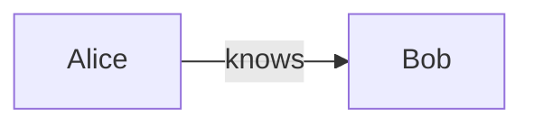
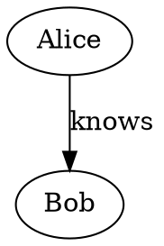

# mcp-memory

A [Model Context Protocol](https://modelcontextprotocol.io) (MCP) server providing
LLM agents with a persistent **knowledge graph memory** — entities, relations, and
observations stored in a compact custom binary log with write-ahead durability.

Speaks MCP over stdio, TCP, and HTTP transports.

```
                 ┌──────────────────────────────────────┐
                 │           mcp-memory server           │
                 │                                      │
  ┌───────┐      │  ┌──────────┐    ┌────────────────┐  │
  │Claude │──────│─>│  stdio / │───>│ KnowledgeGraph  │  │
  │Desktop│      │  │  TCP /   │    │  • entities     │  │
  └───────┘      │  │  HTTP    │    │  • relations    │  │
                 │  └──────────┘    │  • observations │  │
                 │         │        └───────┬────────┘  │
                 │         │                │           │
                 │         v                v           │
                 │  ┌──────────────────────────────┐    │
                 │  │  Binary write-ahead log      │    │
                 │  │  (append-only, fsynced)      │    │
                 │  └──────────────────────────────┘    │
                 └──────────────────────────────────────┘
```

## Installation

```sh
cargo install mcp-memory
```

## Quick start

```sh
mcp-memory -f ./my-memory.bin --transport stdio
```

The memory file path is resolved in order:

1. `--memory-file` / `-f` flag
2. `MEMORY_FILE_PATH` environment variable
3. Default: `memory.mcpmem` in the working directory

### Transports

| Transport | Flag | Description |
|-----------|------|-------------|
| stdio | `--transport stdio` | Newline-delimited JSON over stdin/stdout (default, for Claude Desktop / Claude Code) |
| tcp | `--transport tcp --bind 0.0.0.0:8080` | Newline-delimited JSON over TCP, concurrent connections |
| http | `--transport http --bind 0.0.0.0:8080` | MCP Streamable HTTP (POST/GET `/mcp`) |

### Claude Desktop config

```json
{
  "mcpServers": {
    "memory": {
      "command": "mcp-memory",
      "args": ["-f", "/absolute/path/to/memory.bin"]
    }
  }
}
```

## Data model

```
Entity(name, entityType, observations[])
  |                          |
  |  ——— relationType ———→   |
  v                          v
Entity(name, entityType, observations[])
```

- **Entity** — a named node with a type (e.g. `person`, `company`, `project`)
  and free-form observation strings.
- **Relation** — a directed edge `(from, to, relationType)` between two
  entities. Relations are undirected in traversal (BFS follows both ways).
- **Observation** — an unstructured fact attached to an entity (e.g.
  `"likes coffee"`, `"founded in 2021"`).

All strings are **interned** on write — repeated values share storage. The
search index tokenizes names, types, and observations for case-insensitive
substring match with relevance ranking.

## Data structures & performance

| Component | Implementation | Notes |
|-----------|---------------|-------|
| String interning | Arena-backed `StringInterner` with capacity-graded growth | O(1) intern/lookup via `get_optional` |
| Entity lookup | 4-shard open-addressing hash table with ctrl-byte probing (Swiss-table style) | L1-touch on probe; ~1/128 false-positive key compares |
| Search | Inverted index with position-free substring search, BM25-style ranking | Incremental re-index on add/delete; no full rebuild |
| Relation storage | Flat `Vec<StoredRelation>` (12 B/record) | Bulk iteration is a single cache-friendly linear scan |
| Temporary maps/sets | `ahash::AHashMap` / `AHashSet` (not SipHash) | 2-5x faster hashing for BFS, adjacency, dedup |
| Concurrency | `parking_lot::RwLock` (no poisoning, fair queuing) | ~30% faster uncontended; readers never block readers |
| Persistence | Append-only binary WAL + compact (atomic rename) | `compact` rewrites state as minimal create-records |

## Tools

### Write tools

#### `create_entities`

Create new entities. Already-existing names (exact match) are silently skipped.

**Input:**
```json
{
  "entities": [
    { "name": "Alice", "entityType": "person", "observations": ["likes coffee", "works at Acme"] }
  ]
}
```

**Complexity:** O(N × O) where N = entities, O = observations per entity.
Dedup check via hash lookup before insert. Each entity writes one WAL record.

---

#### `create_relations`

Create directed relations between entities. Duplicates (same from/to/type) are silently skipped.

**Input:**
```json
{
  "relations": [
    { "from": "Alice", "to": "Bob", "relationType": "knows" }
  ]
}
```

**Complexity:** O(R) with dedup via `HashSet<(StrId,StrId,StrId)>`.

---

#### `add_observations`

Append observations to existing entities. Duplicate observation contents are skipped per entity.

**Input:**
```json
{
  "observations": [
    { "entityName": "Alice", "contents": ["drinks matcha", "runs marathons"] }
  ]
}
```

**Complexity:** O(M) per entity where M = new observations. Dedup via `HashSet<StrId>` of existing.

---

#### `delete_entities`

Delete entities by name. Relations touching any deleted entity (from or to) are cascaded away.

**Input:**
```json
{
  "entityNames": ["Alice", "Bob"]
}
```

**Complexity:** O(E + R) — entity lookup is O(1) each, relation cascade is
`retain` over the flat relation vec.

---

#### `delete_observations`

Remove specific observations from an entity.

**Input:**
```json
{
  "deletions": [
    { "entityName": "Alice", "observations": ["likes coffee"] }
  ]
}
```

---

#### `delete_relations`

Remove exact `(from, to, relationType)` tuples.

**Input:**
```json
{
  "relations": [
    { "from": "Alice", "to": "Bob", "relationType": "knows" }
  ]
}
```

**Complexity:** O(R) — `retain` with a `HashSet` of target triples.

---

#### `upsert_entities`

Create-or-merge entities idempotently. New entities are created; existing
entities keep their type and gain any new (deduplicated) observations. Safe
to re-assert facts without overwriting accumulated knowledge.

**Input:**
```json
{
  "entities": [
    { "name": "Alice", "entityType": "person", "observations": ["new fact"] }
  ]
}
```

**Returns:** per-entity `{ created: bool, addedObservations: [...] }`.

**Complexity:** O(O) for merge (dedup by observation HashSet), O(1) create.

---

#### `merge_entities`

Merge **source** entity into **target**. All observations from source are added
to target (deduplicated via `add_observations`), all relations involving source
are redirected to target (deduplicated via batch `create_relations`), and then
source is deleted. Self-loop relations (which become target→target after
redirect) are silently dropped.

Use this to collapse duplicate entities the LLM accidentally created.

**Input:**
```json
{
  "source": "Alice",
  "target": "Alicia"
}
```

**Returns:**
```json
{
  "source": "Alice",
  "target": "Alicia",
  "movedObservations": 3,
  "addedObservations": 3,
  "redirectedRelations": 2
}
```

**WAL:** Three sub-operations — `add_observations`, `create_relations`, `delete_entities` — each log their own records. Replay from disk reconstructs the merge exactly.

**Complexity:** O(S + R) where S = source observations, R = incident relations.

---

#### `compact`

Rewrite the binary log from current in-memory state, discarding all deleted
entities, tombstoned observations, and rolled-back relations. Produces a fresh
minimal log containing only the current graph. Crash-safe: writes to a temp
file, then `rename(2)` atomically over the original. Also rebuilds the
in-memory interner (reclaiming freed arena space).

**Input:** (none)

**Complexity:** O(V + E) scan plus full rewrite to temp file.

---

### Read tools

#### `read_graph`

Return all entities and relations (or a filtered, paginated slice). With no
arguments, streams the full graph through a borrowing serialization view that
avoids allocating intermediate strings.

When `entityType` is specified, relations are restricted to those whose **both**
endpoints are in the returned entity page (internally consistent slice).

**Input:**
```json
{
  "entityType": "person",
  "offset": 0,
  "limit": 50
}
```

**Complexity:** O(V + E) unfiltered; O(V) filter (one linear scan of slots).

---

#### `search_nodes`

Relevance-ranked full-text search over entity names, types, and observation
content (case-insensitive substring). Returns matching entities and relations
connected to them. Results ordered by relevance score descending.

**Input:**
```json
{
  "query": "coffee",
  "entityType": "person",
  "offset": 0,
  "limit": 20
}
```

**Complexity:** O(I) search index query + O(K) score-take for K results.
Incremental index (no full rebuild on mutation).

---

#### `open_nodes`

Fetch specific entities by name, plus any relations connected to them (from
either endpoint). Returns entities in input order; nonexistent names are
silently omitted.

**Input:**
```json
{
  "names": ["Alice", "Bob"]
}
```

**Complexity:** O(N + R') where N = requested names, R' = incident relations.

---

#### `get_entity`

Fetch a single entity by exact name (entity + observations only, no relations).

**Input:**
```json
{
  "name": "Alice"
}
```

**Complexity:** O(1) — Swiss-table lookup → entity output.

---

#### `batch_get_entities`

Fetch multiple entities by name in one call (order preserved, null for missing).
Cuts N serial `get_entity` round-trips (each with dispatch + JSON parse +
JSON serialize overhead) down to one.

**Input:**
```json
{
  "names": ["Alice", "Bob", "Ghost"]
}
```

**Returns:**
```json
[{"name":"Alice",...}, {"name":"Bob",...}, null]
```

**Complexity:** O(N) — each lookup is O(1) name-table probe.

---

#### `graph_stats`

Aggregate statistics about the knowledge graph.

**Input:** (none)

**Returns:**
```json
{
  "entities": 142,
  "relations": 389,
  "totalObservations": 1057,
  "searchIndexEntries": 142,
  "internedStrings": 876,
  "internedBytes": 25432
}
```

**Complexity:** O(V + E) — one linear scan.

---

#### `search_relations`

Filter relations by optional `from`, `to`, and/or `relationType`. Omitted or
empty fields match all values. Returns matching relation objects.

**Input:**
```json
{
  "from": "Alice",
  "relationType": "knows"
}
```

**Complexity:** O(R) — linear scan with optional filter on interned StrIds.

---

#### `find_path`

Single BFS shortest path (undirected) between two entities. Returns the
sequence of entity names connecting them inclusive of both endpoints.

**Input:**
```json
{
  "from": "Alice",
  "to": "Charlie"
}
```

**Returns:** `["Alice", "Bob", "Charlie"]`

**Complexity:** O(V + E) — builds adjacency map once, then BFS.

---

#### `find_all_paths`

DFS with backtracking enumerating all simple paths (not just the shortest)
between two entities. Use this to discover alternative routes the LLM may not
have considered — e.g., two people might be connected through work, through
family, and through a shared hobby, each being a different path.

The `maxPaths` cap prevents combinatorial explosion in dense graphs.

**Input:**
```json
{
  "from": "Alice",
  "to": "Charlie",
  "maxDepth": 6,
  "maxPaths": 50
}
```

**Returns:**
```json
[
  ["Alice", "Bob", "Charlie"],
  ["Alice", "Charlie"]
]
```

**Complexity:** O(b^d) worst-case where b = avg branching factor, d = maxDepth.
The `maxPaths` and `maxDepth` parameters bound actual runtime.

---

#### `extract_subgraph`

Extract a connected subgraph around one or more seed entity names, expanding
out to `depth` hops along all relations (undirected). Returns all reached
entities plus the relations among them (only those whose both endpoints are
in the reached set). Replaces N serial `get_neighbors` calls with a single
O(R + V) pass.

**Input:**
```json
{
  "names": ["Alice", "Bob"],
  "depth": 2
}
```

**Complexity:** O(R) to build adjacency map + O(V + E) BFS for the reached
subgraph. Uses `ahash` maps/sets for hashing.

---

#### `describe_entity`

One-shot context bundle for a single entity: the entity with its observations,
every incident relation (with direction), distinct neighbor names, and degree.
Replaces a `get_entity` plus two `search_relations` calls.

**Input:**
```json
{
  "name": "Alice"
}
```

**Returns:**
```json
{
  "entity": { "name": "Alice", "entityType": "person", "observations": [...] },
  "relations": [{ "from": "Alice", "to": "Bob", "relationType": "knows" }, ...],
  "neighbors": ["Bob", "Charlie"],
  "degree": 2
}
```

**Complexity:** O(R') — one linear pass over relations touching the entity.

---

#### `list_entity_types`

List all distinct entity types with live-entity counts, ranked by count
descending (ties by name). Use this to discover the schema of the memory.

**Input:** (none)

**Returns:**
```json
[{"type": "person", "count": 45}, {"type": "company", "count": 12}, ...]
```

**Complexity:** O(V) — one linear scan, count via AHmap.

---

#### `list_relation_types`

List all distinct relation types with counts, ranked by count descending.

**Input:** (none)

**Returns:**
```json
[{"type": "knows", "count": 89}, {"type": "works_at", "count": 34}, ...]
```

**Complexity:** O(R) — one linear scan.

---

#### `export_graph`

Export the entire graph as `json` (entities + relations), `mermaid` (diagram),
or `dot` (Graphviz).

**Input:**
```json
{
  "format": "mermaid"
}
```

**Format examples:**

`json` — the full `{ entities: [...], relations: [...] }` object.

`mermaid` — a flowchart:


`dot` — a directed graph:


---

## Architecture

```
main.rs
  │
  ├── MCPServer::run_stdio()   — stdio transport (newline-delimited JSON-RPC)
  ├── MCPServer::run_tcp()     — TCP transport  (same framing, concurrent conns)
  └── MCPServer::run_http()    — MCP Streamable HTTP (axum, POST/GET /mcp)
        │
        └── process_request()
              │
              ├── "initialize"     → protocol version + capabilities
              ├── "tools/list"     → cached from tools.json
              ├── "tools/call"     → dispatches to handler by name
              ├── "ping"           → null
              └── "notifications/" → no reply
```

All three transports share `process_value()` / `dispatch_line()` / `dispatch_http_body()`
— the dispatch core is **transport-agnostic**. HTTP uses `tokio::task::spawn_blocking`
for graph access since the reads are synchronous.

### Locking

The `KnowledgeGraph` is guarded by `parking_lot::RwLock`:

- Concurrent readers never block each other (proven by test).
- Writers wait for all readers to drain, then proceed exclusively.
- No poisoning — lock acquisition returns the guard directly, not a `Result`.

### Write-ahead log (WAL)

Every mutation goes through this sequence **before** touching in-memory state:

1. Encode the mutation as a binary record
2. Append to `BufWriter<File>`
3. Update in-memory structures
4. On flush: `BufWriter::flush` + `File::sync_all`

This means a crash between steps 2 and 3 results in the record being replayed
on next startup — the mutation is applied during replay. The log format is

| Field | Size | Description |
|-------|------|-------------|
| CRC32 | 4 B | Checksum of data payload |
| Kind  | 1 B | Record variant (CreateEntity, etc.) |
| Len   | 4 B | Data payload length (LE, max 64 KiB) |
| Data  | variable | Bincode-encoded payload |

`compact` rewrites the log to contain only the minimal `CreateEntity` /
`CreateRelation` records needed to reconstruct the current state.

## Development

```sh
cargo test                           # 201 tests: unit + integration + fuzzy
cargo clippy --all-targets
cargo build --release                # LTO + fat + panic=abort
cargo bench                          # criterion benchmarks
```

The test suite includes:
- **60 unit tests** — intern, search, protocol, store encode/decode, tools, server dispatch
- **118 integration tests** — CRUD, persistence roundtrip, search, paths, export, concurrency,
  RwLock proofs, and all 24 tool handlers
- **23 fuzzy tests** — randomized CRUD sequences asserting graph invariants,
  Unicode/large-string stress, and concurrent mutation consistency

## License

Licensed under the [Apache License, Version 2.0](LICENSE).
