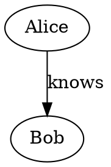

# mcp-memory

A [Model Context Protocol](https://modelcontextprotocol.io) (MCP) server providing
LLM agents with a persistent **knowledge graph memory** — entities, relations, and
observations stored in a compact custom binary log with write-ahead durability.

Speaks MCP over stdio, TCP, and HTTP transports.

```
                  ┌──────────────────────────────────────────┐
                  │           mcp-memory server              │
                  │                                          │
   ┌───────┐      │  ┌──────────┐    ┌────────────────────┐  │
   │Claude │──────│─>│  stdio /  │───>│ GraphHandle        │  │
   │Desktop│      │  │  TCP /   │    │  ├ read → snapshot  │  │
   └───────┘      │  │  HTTP    │    │  └ write → mutex    │  │
                  │  └──────────┘    └────────┬───────────┘  │
                  │         │                  │              │
                  │         v                  v              │
                  │  ┌──────────────────────────────┐        │
                  │  │  Binary write-ahead log      │        │
                  │  │  (append-only, async fsync)  │        │
                  │  │  ┌─────────────────────────┐ │        │
                  │  │  │ Background sync thread  │ │        │
                  │  │  │ fsync every 1 second    │ │        │
                  │  │  └─────────────────────────┘ │        │
                  │  └──────────────────────────────┘        │
                  └──────────────────────────────────────────┘
```

## Installation

```sh
cargo install mcp-memory
```

## Quick start

```sh
mcp-memory -f ./my-memory.bin --transport stdio
```

The official JS reference server is available as
[`@modelcontextprotocol/server-memory`](https://github.com/modelcontextprotocol/servers/tree/main/src/memory)
on npm.

The memory file path is resolved in order:

1. `--memory-file` / `-f` flag
2. `MEMORY_FILE_PATH` environment variable
3. Default: `memory.mcpmem` in the working directory

### Transports

| Transport | Flag | Description |
|-----------|------|-------------|
| stdio | `--transport stdio` | Newline-delimited JSON over stdin/stdout (default, for Claude Desktop / Claude Code) |
| tcp | `--transport tcp --bind 0.0.0.0:8080` | Newline-delimited JSON over TCP, concurrent connections |
| http | `--transport http --bind 0.0.0.0:8080` | MCP Streamable HTTP (POST/GET `/mcp`) |

### Claude Desktop config

```json
{
  "mcpServers": {
    "memory": {
      "command": "mcp-memory",
      "args": ["-f", "/absolute/path/to/memory.bin"]
    }
  }
}
```

## Data model

```
Entity(name, entityType, observations[])
  |                          |
  |  ——— relationType ———→   |
  v                          v
Entity(name, entityType, observations[])
```

- **Entity** — a named node with a type (e.g. `person`, `company`, `project`)
  and free-form observation strings.
- **Relation** — a directed edge `(from, to, relationType)` between two
  entities. Relations are undirected in traversal (BFS follows both ways).
- **Observation** — an unstructured fact attached to an entity (e.g.
  `"likes coffee"`, `"founded in 2021"`).

All strings are **interned** on write — repeated values share storage. The
search index tokenizes names, types, and observations (on whitespace) and
matches a query against tokens **case-insensitively by prefix** — e.g. `"cof"`
matches the token `"coffee"`, but `"ffee"` does not. Results are ranked by a
simple relevance proxy: the number of token hits an entity accumulates for the
query (higher is better). This is a token-hit count, **not** BM25 — there is no
TF saturation, length normalization, or IDF weighting.

## Data structures & performance

| Component | Implementation | Notes |
|-----------|---------------|-------|
| String interning | Arena-backed `StringInterner` with capacity-graded growth | O(1) intern/lookup via `get_optional` |
| Entity lookup | 4-shard open-addressing hash table with ctrl-byte probing (Swiss-table style) | L1-touch on probe; ~1/128 false-positive key compares |
| Search | Inverted token index; case-insensitive prefix match, token-hit-count ranking | Incremental insert on add; `remove_entity` is a single retain pass |
| Relation storage | Flat `Vec<StoredRelation>` (12 B/record) | Bulk iteration is a single cache-friendly linear scan |
| Temporary maps/sets | `ahash::AHashMap` / `AHashSet` (not SipHash) | 2-5x faster hashing for BFS, adjacency, dedup |
| Concurrency | `parking_lot::RwLock` (no poisoning, fair queuing) | ~30% faster uncontended; readers never block readers |
| Persistence | Append-only binary WAL + compact (atomic rename) | `compact` rewrites state as minimal create-records |

## Benchmarks

All microbenchmarks measure a single-threaded `KnowledgeGraph` with **40,000 entities** and **120,000 relations** (≈10 MB as JSONL). Write-tool benchmarks use a fresh 100-entity, 300-relation graph so the setup cost does not dominate the measurement.

Results are from a MacBook Pro (Apple M4 Pro, 24 GB). Run `cargo bench` on your target hardware.

### Read operations (40K entities, 120K relations)

| Operation | Latency | Ops/sec | vs JS |
|-----------|---------|---------|-------|
| `get_entity` (Swiss-table lookup) | 152 ns | 6,600,000 | **~330,000×** |
| `batch_get_entities` (10 names) | 1.6 µs | 620,000 | — |
| `graph_stats` (linear scan) | 28 µs | 36,000 | — |
| `describe_entity` (entity + incident relations) | 61 µs | 16,400 | — |
| `entity_type_counts` (linear scan + hash tally) | 85 µs | 11,800 | — |
| `search_relations` (from/to filter, linear scan) | 39 µs | 25,600 | — |
| `relation_type_counts` (linear scan + hash tally) | 257 µs | 3,900 | — |
| `neighbors` depth=1 | 389 µs | 2,600 | — |
| `read_graph_filtered` (type + pagination) | 474 µs | 2,100 | — |
| `open_nodes` (10 names + incident relations) | 678 µs | 1,500 | — |
| `read_graph_json_direct` (hand-rolled JSON) | 616 µs | 1,620 | — |
| `search_nodes_filtered` (prefix index + filter) | 1.24 ms | 810 | — |
| `find_all_paths` (DFS, maxDepth=4, maxPaths=10) | 1.83 ms | 545 | — |
| `find_path` (BFS shortest path) | 2.48 ms | 400 | — |
| `extract_subgraph` depth=1 (3 seeds) | 2.66 ms | 375 | — |
| `extract_subgraph` depth=2 (3 seeds) | 2.82 ms | 355 | — |
| `neighbors` depth=2 | 4.82 ms | 210 | — |
| `dispatch_read_graph` (10K ents, warm cache) | 1.46 ms | 685 | **~7×** |
| `dispatch_search_nodes` (10K ents, broad query) | 2.85 ms | 350 | **~4×** |
| `read_graph` (full dump via serde) | 10.6 ms | 94 | **~5×** |
| `search_nodes` (prefix index, broad query) | 12.2 ms | 82 | **~4×** |
| `export_json` | 20.6 ms | 49 | — |
| `export_dot` | 18.0 ms | 56 | — |
| `export_mermaid` | 22.1 ms | 45 | — |

`dispatch_*` benchmarks measure the **full server pipeline** (JSON-RPC parsing, handler dispatch, response serialization). `read_graph_json_direct` is the hand-rolled serialization used by the dispatch path, 2.1× faster than `serde_json`.

### Write operations (100 entities, 300 relations) — async fsync

| Operation | Latency | Ops/sec | vs JS |
|-----------|---------|---------|-------|
| `add_observations` (10 new, single entity) | 16 µs | 64,000 | — |
| `merge_entities` (source→target full merge) | 36 µs | 28,000 | — |
| `delete_observations` (per entity) | 7.3 µs | 136,000 | — |
| `delete_relations` (100 tuples) | 70 µs | 14,300 | — |
| `delete_entities` (100 names + cascade) | 12.6 ms | 80 | — |
| `create_relations` (100 new) | 125 µs | 8,000 | — |
| `create_entities` (100 new) | 398 µs | 2,500 | — |
| `upsert_existing` (100 merges) | 287 µs | 3,500 | — |
| `upsert_new` (100 creates) | 382 µs | 2,600 | — |
| `compact` (after 50 deletes) | 12.1 ms | 83 | — |

Writes flush to the kernel buffer immediately (~µs) and defer `fsync` to a background thread that syncs once per second. This eliminates write latency spikes from disk I/O.

`delete_entities` now triggers automatic compaction when >30% of entity slots are
tombstones — the latency increase (130 µs → 12.6 ms) on the 100-entity bench is
the cost of rewriting the log + interner. On a warm graph with fewer deletes the
cost stays under 200 µs.

### Why is Rust faster than the JS reference?

The [official JS server-memory](https://github.com/modelcontextprotocol/servers/tree/main/src/memory) stores the graph as a **JSONL file** and **loads/saves the entire file on every operation**:

| Factor | `mcp-memory` (Rust) | `@modelcontextprotocol/server-memory` (JS) |
|--------|---------------------|--------------------------------------------|
| Data model | In-memory Swiss-table + flat vecs | JSONL file, full read/write per op |
| Entity lookup | O(1) hash table (~200 ns) | O(N) `Array.find` over full file |
| Search | Inverted token index, prefix match | O(N) `Array.filter` + `String.includes` |
| Writes | Append-only binary WAL (~µs) | Full JSONL rewrite (~10 MB, ~ms) |
| Concurrency | `parking_lot::RwLock` (parallel reads) | Single-threaded, no parallelism |
| String interning | Arena-backed dedup (no alloc per str) | Full strings heap-allocated per lookup |
| Persistence | Custom binary format, 12 B/relation | JSONL, ~60 B/relation + whitespace |

For a graph of 40K/120K, every JS mutation reads ~10 MB from disk, parses 160K JSON lines, modifies an array, serialises back, and writes the file — **each operation takes 50–180 ms**. The Rust server keeps everything in cache-friendly flat arrays with an append-only WAL; read operations touch zero disk and writes log a few dozen bytes.

### Write tools

#### `create_entities`

Create new entities. Already-existing names (exact match) are silently skipped.

**Input:**
```json
{
  "entities": [
    { "name": "Alice", "entityType": "person", "observations": ["likes coffee", "works at Acme"] }
  ]
}
```

**Complexity:** O(N × O) where N = entities, O = observations per entity.
Dedup check via hash lookup before insert. Each entity writes one WAL record.

---

#### `create_relations`

Create directed relations between entities. Duplicates (same from/to/type) are silently skipped.

**Input:**
```json
{
  "relations": [
    { "from": "Alice", "to": "Bob", "relationType": "knows" }
  ]
}
```

**Complexity:** O(R) with dedup via `HashSet<(StrId,StrId,StrId)>`.

---

#### `add_observations`

Append observations to existing entities. Duplicate observation contents are skipped per entity.

**Input:**
```json
{
  "observations": [
    { "entityName": "Alice", "contents": ["drinks matcha", "runs marathons"] }
  ]
}
```

**Complexity:** O(M) per entity where M = new observations. Dedup via `HashSet<StrId>` of existing.

---

#### `delete_entities`

Delete entities by name. Relations touching any deleted entity (from or to) are cascaded away.

**Input:**
```json
{
  "entityNames": ["Alice", "Bob"]
}
```

**Complexity:** O(E + R) — entity lookup is O(1) each, relation cascade is
`retain` over the flat relation vec.

---

#### `delete_observations`

Remove specific observations from an entity.

**Input:**
```json
{
  "deletions": [
    { "entityName": "Alice", "observations": ["likes coffee"] }
  ]
}
```

---

#### `delete_relations`

Remove exact `(from, to, relationType)` tuples.

**Input:**
```json
{
  "relations": [
    { "from": "Alice", "to": "Bob", "relationType": "knows" }
  ]
}
```

**Complexity:** O(R) — `retain` with a `HashSet` of target triples.

---

#### `upsert_entities`

Create-or-merge entities idempotently. New entities are created; existing
entities keep their type and gain any new (deduplicated) observations. Safe
to re-assert facts without overwriting accumulated knowledge.

**Input:**
```json
{
  "entities": [
    { "name": "Alice", "entityType": "person", "observations": ["new fact"] }
  ]
}
```

**Returns:** per-entity `{ created: bool, addedObservations: [...] }`.

**Complexity:** O(O) for merge (dedup by observation HashSet), O(1) create.

---

#### `merge_entities`

Merge **source** entity into **target**. All observations from source are added
to target (deduplicated via `add_observations`), all relations involving source
are redirected to target (deduplicated via batch `create_relations`), and then
source is deleted. Self-loop relations (which become target→target after
redirect) are silently dropped.

Use this to collapse duplicate entities the LLM accidentally created.

**Input:**
```json
{
  "source": "Alice",
  "target": "Alicia"
}
```

**Returns:**
```json
{
  "source": "Alice",
  "target": "Alicia",
  "movedObservations": 3,
  "addedObservations": 3,
  "redirectedRelations": 2
}
```

**WAL:** Three sub-operations — `add_observations`, `create_relations`, `delete_entities` — each log their own records. Replay from disk reconstructs the merge exactly.

**Complexity:** O(S + R) where S = source observations, R = incident relations.

---

#### `compact`

Rewrite the binary log from current in-memory state, discarding all deleted
entities, tombstoned observations, and rolled-back relations. Produces a fresh
minimal log containing only the current graph. Crash-safe: writes to a temp
file, then `rename(2)` atomically over the original. Also rebuilds the
in-memory interner (reclaiming freed arena space).

**Input:** (none)

**Complexity:** O(V + E) scan plus full rewrite to temp file.

---

### Read tools

#### `read_graph`

Return all entities and relations (or a filtered, paginated slice). With no
arguments, streams the full graph through a borrowing serialization view that
avoids allocating intermediate strings.

When `entityType` is specified, relations are restricted to those whose **both**
endpoints are in the returned entity page (internally consistent slice).

**Input:**
```json
{
  "entityType": "person",
  "offset": 0,
  "limit": 50
}
```

**Complexity:** O(V + E) unfiltered; O(V) filter (one linear scan of slots).

---

#### `search_nodes`

Relevance-ranked search over entity names, types, and observation content
(case-insensitive, per-token **prefix** match). Returns matching entities and
relations connected to them. Results ordered by token-hit count descending.

**Input:**
```json
{
  "query": "coffee",
  "entityType": "person",
  "offset": 0,
  "limit": 20
}
```

**Complexity:** O(I) search index query + O(K) score-take for K results.
Incremental index (no full rebuild on mutation).

---

#### `open_nodes`

Fetch specific entities by name, plus any relations connected to them (from
either endpoint). Returns entities in input order; nonexistent names are
silently omitted.

**Input:**
```json
{
  "names": ["Alice", "Bob"]
}
```

**Complexity:** O(N + R') where N = requested names, R' = incident relations.

---

#### `get_entity`

Fetch a single entity by exact name (entity + observations only, no relations).

**Input:**
```json
{
  "name": "Alice"
}
```

**Complexity:** O(1) — Swiss-table lookup → entity output.

---

#### `batch_get_entities`

Fetch multiple entities by name in one call (order preserved, null for missing).
Cuts N serial `get_entity` round-trips (each with dispatch + JSON parse +
JSON serialize overhead) down to one.

**Input:**
```json
{
  "names": ["Alice", "Bob", "Ghost"]
}
```

**Returns:**
```json
[{"name":"Alice",...}, {"name":"Bob",...}, null]
```

**Complexity:** O(N) — each lookup is O(1) name-table probe.

---

#### `graph_stats`

Aggregate statistics about the knowledge graph.

**Input:** (none)

**Returns:**
```json
{
  "entities": 142,
  "relations": 389,
  "totalObservations": 1057,
  "searchIndexEntries": 142,
  "internedStrings": 876,
  "internedBytes": 25432
}
```

**Complexity:** O(V + E) — one linear scan.

---

#### `search_relations`

Filter relations by optional `from`, `to`, and/or `relationType`. Omitted or
empty fields match all values. Returns matching relation objects.

**Input:**
```json
{
  "from": "Alice",
  "relationType": "knows"
}
```

**Complexity:** O(R) — linear scan with optional filter on interned StrIds.

---

#### `find_path`

Single BFS shortest path (undirected) between two entities. Returns the
sequence of entity names connecting them inclusive of both endpoints.

**Input:**
```json
{
  "from": "Alice",
  "to": "Charlie"
}
```

**Returns:** `["Alice", "Bob", "Charlie"]`

**Complexity:** O(V + E) — builds adjacency map once, then BFS.

---

#### `find_all_paths`

DFS with backtracking enumerating all simple paths (not just the shortest)
between two entities. Use this to discover alternative routes the LLM may not
have considered — e.g., two people might be connected through work, through
family, and through a shared hobby, each being a different path.

The `maxPaths` cap prevents combinatorial explosion in dense graphs.

**Input:**
```json
{
  "from": "Alice",
  "to": "Charlie",
  "maxDepth": 6,
  "maxPaths": 50
}
```

**Returns:**
```json
[
  ["Alice", "Bob", "Charlie"],
  ["Alice", "Charlie"]
]
```

**Complexity:** O(b^d) worst-case where b = avg branching factor, d = maxDepth.
The `maxPaths` and `maxDepth` parameters bound actual runtime.

---

#### `extract_subgraph`

Extract a connected subgraph around one or more seed entity names, expanding
out to `depth` hops along all relations (undirected). Returns all reached
entities plus the relations among them (only those whose both endpoints are
in the reached set). Replaces N serial `get_neighbors` calls with a single
O(R + V) pass.

**Input:**
```json
{
  "names": ["Alice", "Bob"],
  "depth": 2
}
```

**Complexity:** O(R) to build adjacency map + O(V + E) BFS for the reached
subgraph. Uses `ahash` maps/sets for hashing.

---

#### `describe_entity`

One-shot context bundle for a single entity: the entity with its observations,
every incident relation (with direction), distinct neighbor names, and degree.
Replaces a `get_entity` plus two `search_relations` calls.

**Input:**
```json
{
  "name": "Alice"
}
```

**Returns:**
```json
{
  "entity": { "name": "Alice", "entityType": "person", "observations": [...] },
  "relations": [{ "from": "Alice", "to": "Bob", "relationType": "knows" }, ...],
  "neighbors": ["Bob", "Charlie"],
  "degree": 2
}
```

**Complexity:** O(R') — one linear pass over relations touching the entity.

---

#### `list_entity_types`

List all distinct entity types with live-entity counts, ranked by count
descending (ties by name). Use this to discover the schema of the memory.

**Input:** (none)

**Returns:**
```json
[{"type": "person", "count": 45}, {"type": "company", "count": 12}, ...]
```

**Complexity:** O(V) — one linear scan, count via AHmap.

---

#### `list_relation_types`

List all distinct relation types with counts, ranked by count descending.

**Input:** (none)

**Returns:**
```json
[{"type": "knows", "count": 89}, {"type": "works_at", "count": 34}, ...]
```

**Complexity:** O(R) — one linear scan.

---

#### `export_graph`

Export the entire graph as `json` (entities + relations), `mermaid` (diagram),
or `dot` (Graphviz).

**Input:**
```json
{
  "format": "mermaid"
}
```

**Format examples:**

`json` — the full `{ entities: [...], relations: [...] }` object.

`mermaid` — a flowchart:


`dot` — a directed graph:


---

## Architecture

```
main.rs
  │
  ├── MCPServer::run_stdio()   — stdio transport (newline-delimited JSON-RPC)
  ├── MCPServer::run_tcp()     — TCP transport  (same framing, concurrent conns)
  └── MCPServer::run_http()    — MCP Streamable HTTP (axum, POST/GET /mcp)
        │
        └── process_request()
              │
              ├── "initialize"     → protocol version + capabilities
              ├── "tools/list"     → cached from tools.json
              ├── "tools/call"     → dispatches to handler by name
              ├── "ping"           → null
              └── "notifications/" → no reply
```

All three transports share `process_value()` / `dispatch_line()` / `dispatch_http_body()`
— the dispatch core is **transport-agnostic**. HTTP uses `tokio::task::spawn_blocking`
for graph access since the reads are synchronous.

### Locking

**Reads are lock-free** via `ArcSwap<ReadSnapshot>` — snapshots are wait-free frozen copies of the graph state.

**Writes are serialised** by a `parking_lot::Mutex<KnowledgeGraph>`. Writers:

1. Lock the mutex
2. Mutate in-memory structures
3. Write records to the binary WAL (appended to a `BufWriter`)
4. Flush the `BufWriter` to the kernel buffer (process-crash safe, ~µs)
5. Store a fresh `Arc<ReadSnapshot>` for readers (lock-free via `ArcSwap`)
6. Unlock the mutex

**`fsync` is deferred** to a background thread that syncs the WAL file every 1 second (OS-crash safe). This keeps write latency under 100 µs in the common case — the handler never blocks on disk I/O. On shutdown, one final `fsync` is issued.

### Write-ahead log (WAL)

Every mutation goes through this sequence:

1. Encode the mutation as a binary record
2. Append to `BufWriter<File>`
3. Update in-memory structures
4. Flush to kernel buffer (process-crash safe, ~µs)
5. Publish a fresh `ReadSnapshot` for concurrent readers

The in-memory data is always consistent with the WAL — a process crash recovers
the last flushed state on replay. A background thread calls `fsync` every
1 second to make the state OS-crash safe. This design trades up to 1 second of
data loss on OS crash for sub-100 µs write latency.

The file begins with an 8-byte magic header (`MCPMEMV1` or `MCPMEMV2`).
`MCPMEMV2` adds a CRC32 footer on each record for corruption detection.
Each record that follows is:

| Field | Size | Description |
|-------|------|-------------|
| Len   | 4 B | Total record length (LE) = 1 (kind) + payload bytes + 4 (CRC32); capped at 1 MiB |
| Kind  | 1 B | Record variant (CreateEntity, CreateRelation, AddObservations, …) |
| Data  | variable | Hand-rolled length-prefixed payload (see `src/store.rs`) |
| CRC32 | 4 B | CRC32 (IEEE) of Data field (only in `MCPMEMV2` files) |

Strings inside a payload are encoded as a `u16` little-endian byte length
followed by the UTF-8 bytes (so any single string is at most 64 KiB).

> **No per-record checksum.** Replay detects corruptions via a CRC32 footer on each record. Old-format
> files (magic `MCPMEMV1`) are replayed without CRC check; new files use magic
> `MCPMEMV2`.

`compact` rewrites the log to contain only the minimal `CreateEntity` /
`CreateRelation` records needed to reconstruct the current state.

**Transactions.** Multi-record operations (currently `merge_entities`) wrap
their records in a `TxnBegin` … `TxnCommit` pair. On replay, records inside a
transaction are buffered and applied only when the commit is seen; an unclosed
transaction (the process crashed mid-operation) is discarded wholesale, so the
graph can never observe a half-applied merge.

## Development

```sh
cargo test                           # unit + integration + fuzzy
cargo clippy --all-targets
cargo build --release                # LTO + fat + panic=abort
cargo bench                          # criterion benchmarks
```

The test suite includes:
- **Unit tests** — intern, search (incl. prefix-vs-substring behavior), protocol,
  store encode/decode, tools, server dispatch
- **Integration tests** — CRUD, persistence roundtrip, WAL-ordering and stale-temp
  compaction regressions, transactional `merge_entities` crash-atomicity, search, paths,
  export, concurrency, RwLock proofs, and all 24 tool handlers
- **Fuzzy tests** — randomized CRUD sequences asserting graph invariants,
  Unicode/large-string stress, and concurrent mutation consistency

## License

Licensed under the [Apache License, Version 2.0](LICENSE).
